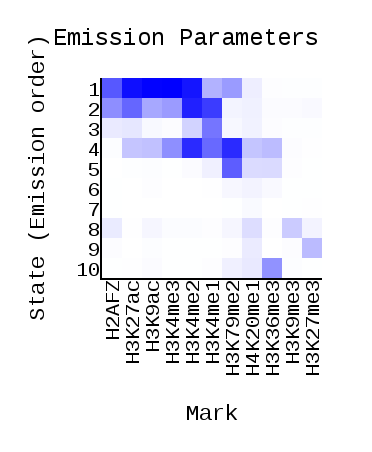
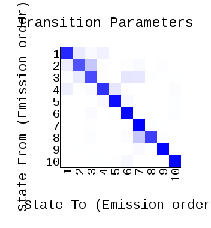
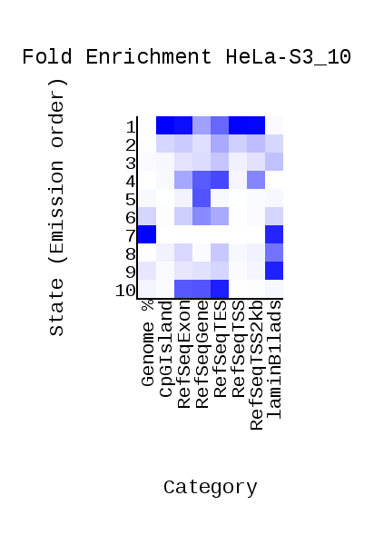
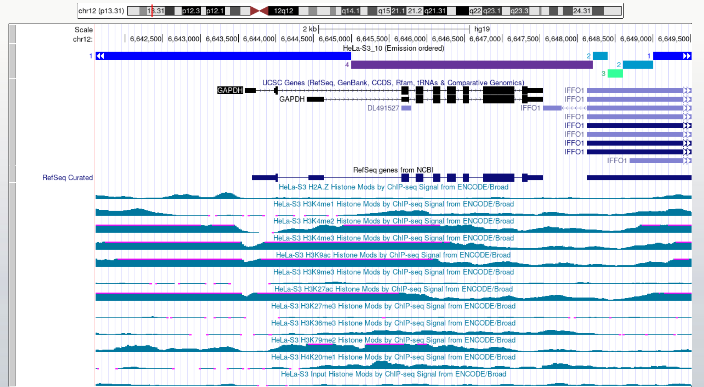
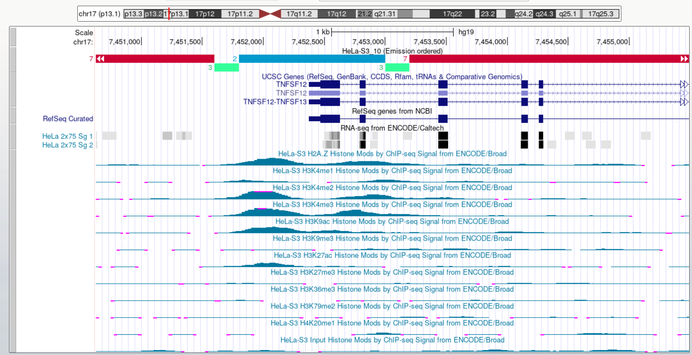
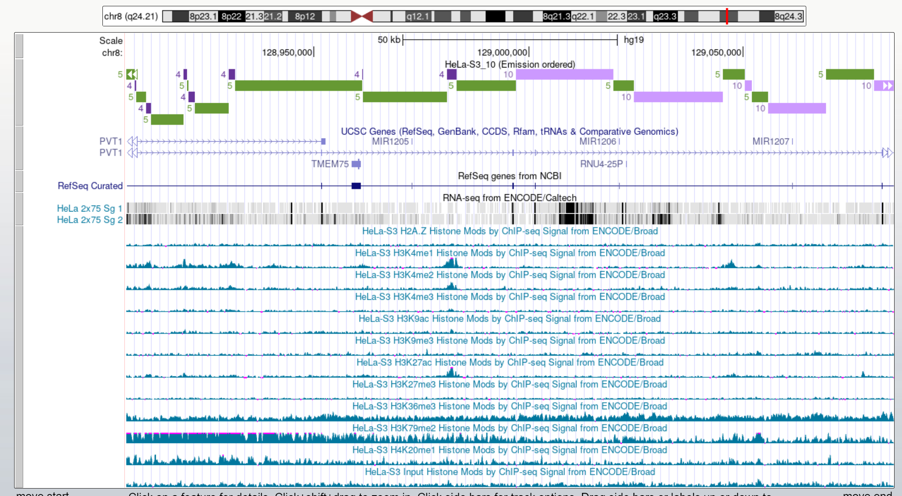
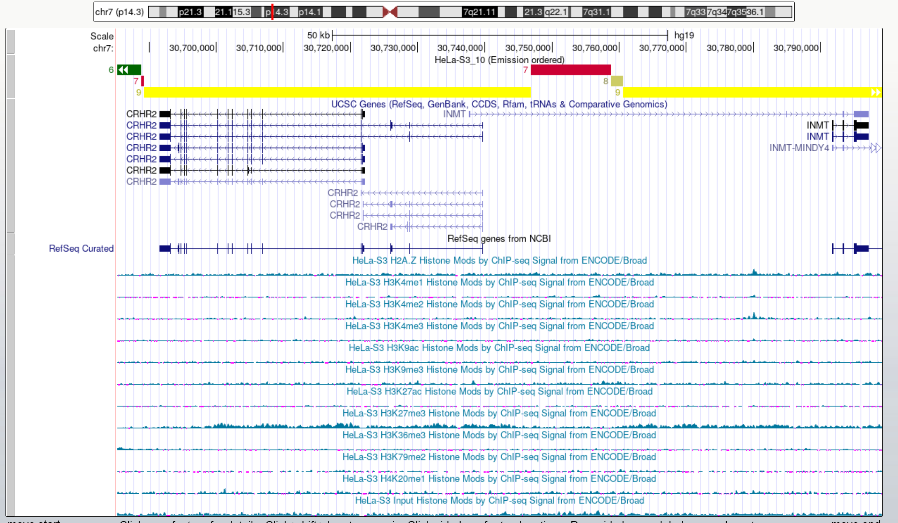
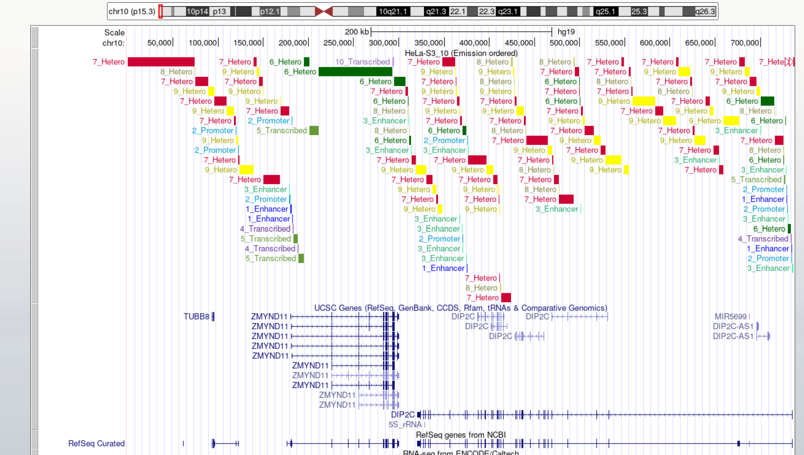

## [IPYNB](/Notebook.ipynb)

## [Папка CromHMM](/data/Output/)
**[HTML-страница](/data/Output/webpage_10.html)**

Emission | Transition | HeLa-S3_10 Overlap Enrichment
-|-|-
||

## Список меток

Метка | Название файла (ссылки есть в Jupyter Notebook'е)
-|-
Контроль | Control.bam
H3K27ac | H3k27ac.bam
H3K27me3 |	H3k27me3.bam
H3K36me3 |	H3k36me3.bam	 
H3K4me1 |	H3k04me1.bam 
H3K4me2 |	H3k4me2.bam
H3K4me3 |	H3k4me3.bam
H3K79me2 |	H3k79me2.bam
H3K9ac |	H3k9ac.bam
H3K9me3 |	H3k09me3.bam
H4K20me1 |	H4k20me1.bam
H2AFZ |	H2az.bam

## [Геномный браузер с моими треками](https://genome.ucsc.edu/s/narek01/HeLa-S3_Bonus)

## Эпигенетические типы

Тип | Название | Характерные метки | Комментарии
-|-|-|-
1 | Enhancer| **H3K4me2**, **H3K4me3**, **H3K9ac**, **H3K27ac**, H2AFZ |
2 | Promoter | **H3K4me2**, **H3K4me1**, H3K27ac, H2AFZ |
3 | Enhancer | **H3K4me1**, H3K4me2 |
4 | Transcribed / Gene bodies | **H3K79me2**, **H3K4me2**, H3K4me1, H3K4me3 |
5 | Transcribed / Intron | **H3K79me2**, H3K36me3, H4K20me1 |
6 | Heterochromatin | H4K20me1, H3K79me2, H3K36me3 (все - слабо) | Покрывает 11% генома
7 | Heterochromatin | H4K20me1 (слабо) | Покрывает 69% генома
8 | Heterochromatin | H3K9me3, H4K20me1 | Встречается очень редко, на стыках 6 и 7
9 | Heterochromatin | **H3K27me3**, H4K20me1 |
10 | Transcribed / Gene bodies | **H3K36me3**, H4K20me1 |

### Скриншоты из UCSC
Эпигенетические типы | Скриншот | Комментарий
-|-|-
1+4 |  | GAPDH - ген домашнего хозяйства
2+3 |  | 2 и 3 расположены возле точки начала транскрипции
4+5+10 |  | 4, 5 и 10 расположены на протяжении всего гена
6+7+8+9 |  | CRHR2 не экспрессируется в линии HeLa

## Бонусная задача

Ссылка на файлы:
[Файлы](/data/Bonus/)




Код:

```python
names = {'1': 'Enhancer',
         '2': 'Promoter',
         '3': 'Enhancer',
         '4': 'Transcribed',
         '5': 'Transcribed',
         '6': 'Hetero',
         '7': 'Hetero',
         '8': 'Hetero',
         '9': 'Hetero',
         '10': 'Transcribed',
}

def bonus(filename):
    with open(f"{filename}.bed", 'r') as f1, open(f"{filename}_new.bed", 'w') as f2:
        file = f1.readlines()

        for s in file:
            if 'chr' in s[0:3]:
                s = s.split('\t')
                s[3] = s[3] + '_' + names[s[3]]
                s = '\t'.join(s)
            f2.write(s)

bonus('HeLa-S3_10_dense')
bonus('HeLa-S3_10_expanded')
```
